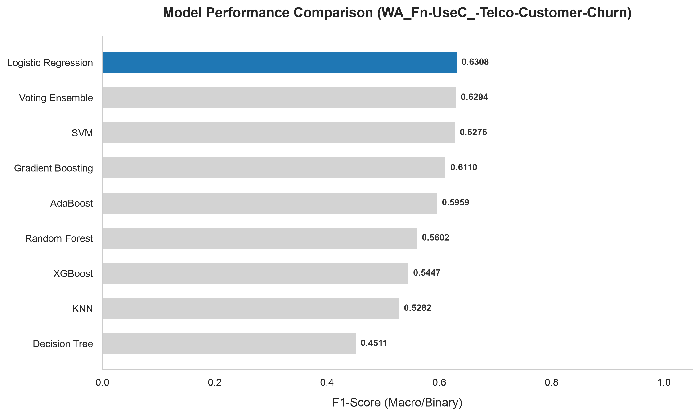
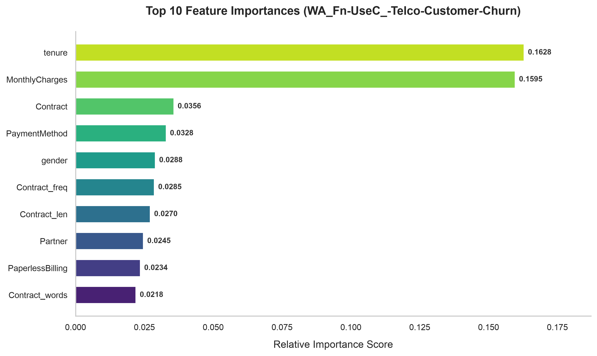
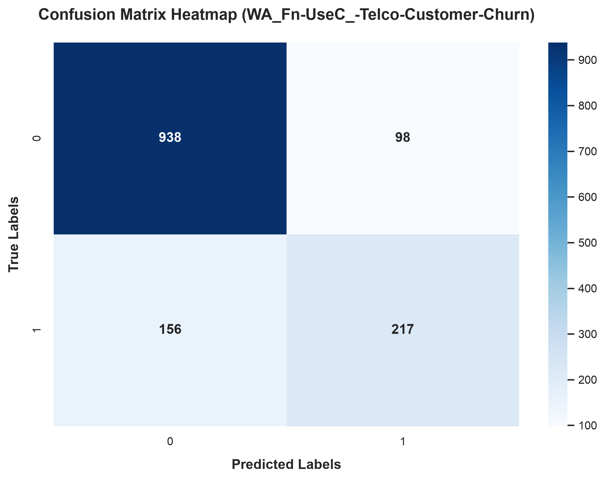
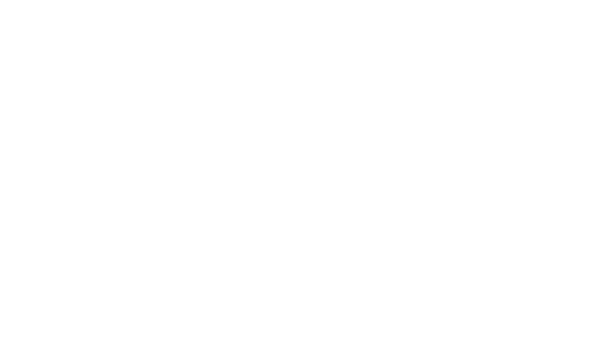

# AutoMLEngineer

AutoMLEngineer is a highly versatile and advanced automated machine learning (AutoML) framework. It ingests arbitrary tabular datasets, automatically detects problem types (classification or regression), conducts advanced feature engineering, trains a diverse pool of models, performs hyperparameter tuning, builds voting ensembles, cross-validates, and outputs a complete suite of professional visual reports and explainability metrics.

## 🛠️ Architecture Overview

The system is organized into modular components located in the `src/ml/` folder, coordinated by the main orchestrator (`src/main.py`):

1. **Data Ingestion & Cleaning** (`data_loader.py` & `data_cleaner.py`): Loads the dataset, handles data types, and automatically imputes missing numerical and categorical values.
2. **Feature Filtering** (`feature_filter.py`): Automatically identifies and drops high-cardinality non-informative identifier columns (e.g. Passenger ID, Names) and zero-variance/constant features.
3. **Advanced Feature Engineering** (`feature_engineer.py`): 
   - Extracts semantic elements (e.g. Deck from Cabin, Title from Name).
   - Generates numeric aggregations (e.g. FamilySize, IsAlone).
   - Evaluates numeric distributions, shifting and applying `log1p` transformations for highly skewed columns (e.g. Fares).
   - Applies frequency encoding ratios to categorical columns.
   - Automatically parses date strings into datetime components (Year, Month, Day, DayOfWeek, Hour).
4. **Target & Problem Detection** (`target_detector.py` & `problem_detector.py`): Automatically infers target columns and classifies the task as classification or regression.
5. **Preprocessing & Training Pipeline** (`preprocessor_builder.py` & `model_trainer.py`): Bundles data preprocessing (standard scaling and one-hot encoding) with 8 classification or 10 regression models inside secure scikit-learn `Pipeline` objects.
6. **Voting Ensemble** (`model_trainer.py`): Combines the top 3 models automatically to form a superior joint estimator (`VotingClassifier` or `VotingRegressor`).
7. **Hyperparameter Tuning** (`model_tuner.py`): Employs `RandomizedSearchCV` on a fast grid to optimize parameters for the best individual model.
8. **Explainability & SHAP** (`explainability.py`): Fits a tree model on preprocessed features to extract SHAP values representing feature contribution/impact.
9. **Result Exporting & Reporting** (`result_exporter.py` & `report_generator.py`): Saves the fitted model pipeline, exports performance summaries in JSON, and generates professional plots.

---

## 📈 Example Visual Reports

After running the pipeline on a dataset, the following visualization assets are saved in the `outputs/` folder:

### 1. Model Comparison Chart
Shows all trained models along one axis, with performance metrics (F1-score for classification or R² for regression) along the other. The best performing model is automatically highlighted.



### 2. Feature Importance Chart
Displays the top 10 features sorted by their overall contribution to the model's predictions.



### 3. Confusion Matrix (Classification Only)
A clean, annotated heatmap displaying predicted versus actual classes.



### 4. SHAP Feature Impact Plots
Two visual assets representing feature-level explainability:
- **SHAP Summary Plot:** Beeswarm-style impact plot demonstrating how high or low values of a feature affect the target variable.
- **SHAP Bar Plot:** Feature rank chart based on mean absolute SHAP values.




---

## 📋 Example JSON Report

Located at `outputs/results.json`, this report captures complete pipeline performance and metadata:

```json
{
    "target": "Pclass",
    "problem_type": "classification",
    "best_model": {
        "best_model": "Voting Ensemble",
        "metrics": {
            "accuracy": 0.9721,
            "precision": 0.9688,
            "recall": 0.9571,
            "f1_score": 0.9627
        }
    },
    "all_models": {
        "Logistic Regression": {
            "accuracy": 0.8380,
            "precision": 0.8029,
            "recall": 0.7479,
            "f1_score": 0.7641
        },
        "Random Forest": {
            "accuracy": 0.9665,
            "precision": 0.9602,
            "recall": 0.9546,
            "f1_score": 0.9568
        },
        "Decision Tree": {
            "accuracy": 0.9553,
            "precision": 0.9387,
            "recall": 0.9437,
            "f1_score": 0.9408
        },
        "KNN": {
            "accuracy": 0.8436,
            "precision": 0.8207,
            "recall": 0.8047,
            "f1_score": 0.8095
        },
        "SVM": {
            "accuracy": 0.8324,
            "precision": 0.8366,
            "recall": 0.7508,
            "f1_score": 0.7754
        },
        "Gradient Boosting": {
            "accuracy": 0.9665,
            "precision": 0.9592,
            "recall": 0.9535,
            "f1_score": 0.9562
        },
        "AdaBoost": {
            "accuracy": 0.8101,
            "precision": 0.7808,
            "recall": 0.7929,
            "f1_score": 0.7821
        },
        "XGBoost": {
            "accuracy": 0.9665,
            "precision": 0.9593,
            "recall": 0.9508,
            "f1_score": 0.9547
        },
        "Voting Ensemble": {
            "accuracy": 0.9721,
            "precision": 0.9688,
            "recall": 0.9571,
            "f1_score": 0.9627
        }
    },
    "cross_validation": {
        "mean_f1_macro": 0.9387,
        "std_f1_macro": 0.0149
    },
    "consultant_report": [
        "Top driver: Fare_log",
        "Second driver: Fare",
        "Third driver: Deck"
    ]
}
```

---

## 🚀 Supported Model List

### Classification
- Logistic Regression
- Random Forest
- Decision Tree
- K-Nearest Neighbors (KNN)
- Support Vector Machine (SVM)
- Gradient Boosting Classifier
- AdaBoost Classifier
- XGBoost Classifier
- **Voting Ensemble** (hard-voting combining top 3 models)

### Regression
- Linear Regression
- Ridge Regression
- Lasso Regression
- Decision Tree Regressor
- Random Forest Regressor
- Gradient Boosting Regressor
- AdaBoost Regressor
- K-Nearest Neighbors Regressor (KNN)
- Support Vector Regressor (SVR)
- XGBoost Regressor
- **Voting Ensemble** (averaging predictions of top 3 models)

---

## 💻 Quick Start

To run the AutoML pipeline on your dataset:
```bash
python src/main.py path/to/your/dataset.csv
```
Optionally, specify a target column override:
```bash
python src/main.py path/to/your/dataset.csv --target your_target_column
```
